# PHP
A beginners handbook for the PHP learners
---

I think the first thing that might come into your mind is that "Isn't PHP already dead?" Trust me, I was thinking the same thing when I started learning this language.

## Index
- [Introduction](#introduction)
- [Installation](#installation)
- IDE/Text Editor
- Customization
- Hello World

## Introduction (What is PHP?)

PHP is actually an abbreviation or acronym for "PHP: Hypertext Preprocessor". It is an open-source scripting language and it is still used widely. Let me tell you about some widely popular websites that use PHP, and it will simply blow your mind thinking that how many popular websites are still using it!

[Facebook](https://facebook.com/), [Wikipedia](https://www.wikipedia.org/), [Tumbler](https://www.tumblr.com/), [Slack](https://slack.com/), [Etsy](https://www.etsy.com/), [MailChimp](https://mailchimp.com/), and even [WordPress](https://wordpress.org/) use PHP! I guess you are also overwhelmed by PHP after getting to know that even these big websites use PHP as a programming language.

## Installation

For this book, I am going to use [XAMPP](https://www.apachefriends.org/) and [Sublime Text](https://www.sublimetext.com/) for showing you everything in PHP.  I am not going to take more time here as the installation process is very similar to other normal software. Simply download the latest version of XAMPP for your operating system and install it afterward.  

If you do not change the installation directory of XAMPP during the installation process, then XAMPP will create the installation folder under the `C:` drive. Simply go to your **C** drive and search for a folder named "xampp".

<figure>
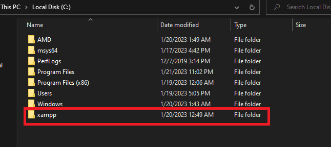
<figcaption align = "center"><b>The necessary directory of XAMPP in C Drive</b></figcaption>
</figure>

Inside the directory, you will get a bunch of folders and files like below.

<figure>
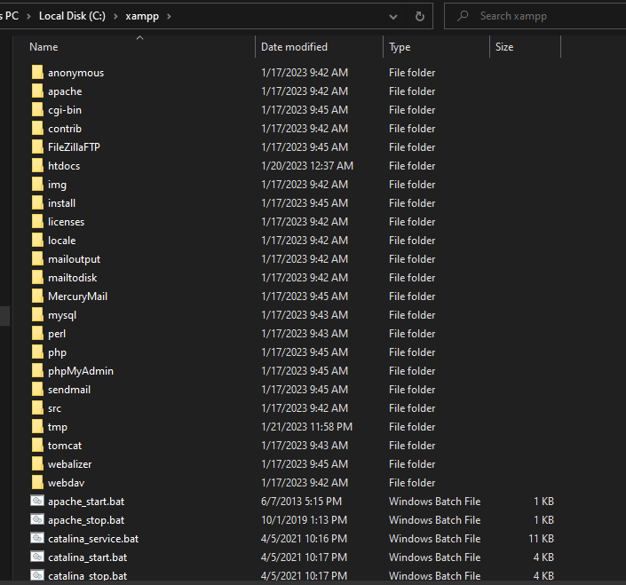
<figcaption align = "center"><b>A lot of files and folders inside the "xampp" folder, but we do not need to worry about these for now!</b></figcaption>
</figure>

We will go into the "**htdocs**" folder.

<figure>
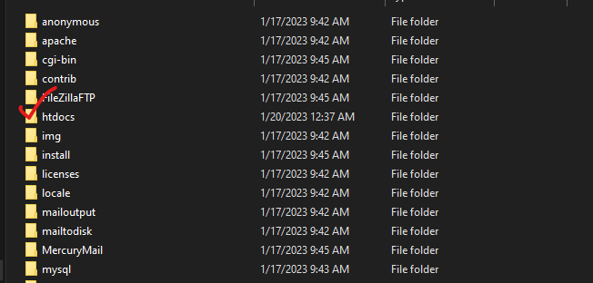
<figcaption align = "center"><b>"htdocs" folder</b></figcaption>
</figure>

We will see some more folders and files inside the "htdocs" folder.

<figure>
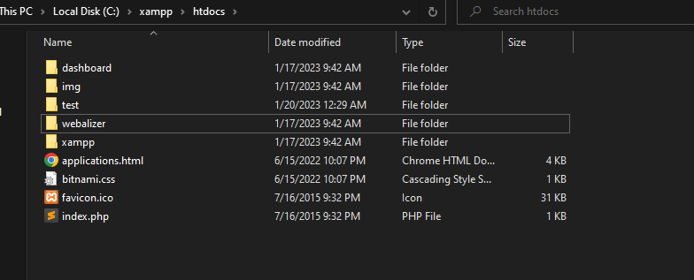
<figcaption align = "center"><b>Folders and Files inside the "htdocs" folder</b></figcaption>
</figure>

We will create a new folder here where we will practice our PHP scripts. For this article, let's say that I am going to use a new folder named "PHPwithFahim". You can name it whatever you want, but make sure not to start the name other than any alphabet, and also do not keep any space between words/characters in the folder name. 

<figure>
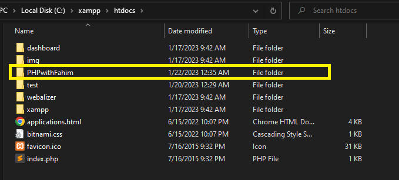
<figcaption align = "center"><b>Folder "PHPwithFahim"</b></figcaption>
</figure>

Now open this folder in your Sublime Text. Simply click on "File" and click on "Open Folder...".

<figure>
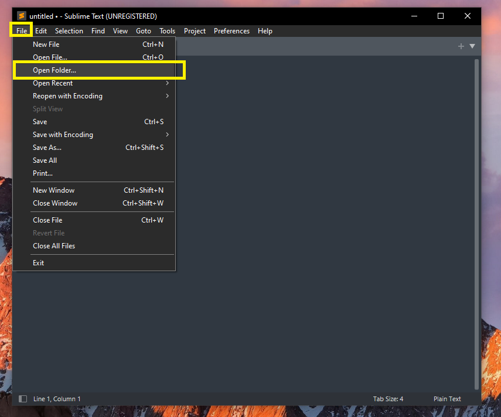
<figcaption align = "center"><b>Open Folder in Sublime Text</b></figcaption>
</figure>

Select the "PHPwithFahim" folder and open it in Sublime Text.

<figure>
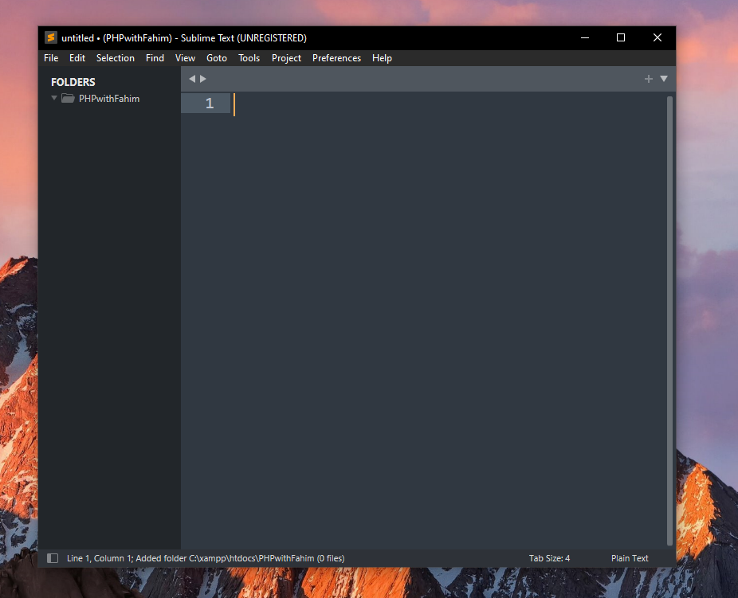
<figcaption align = "center"><b></b></figcaption>
</figure>

Now, create a file "index.php", and save it to "PHPwithFahim" folder. 

<figure>
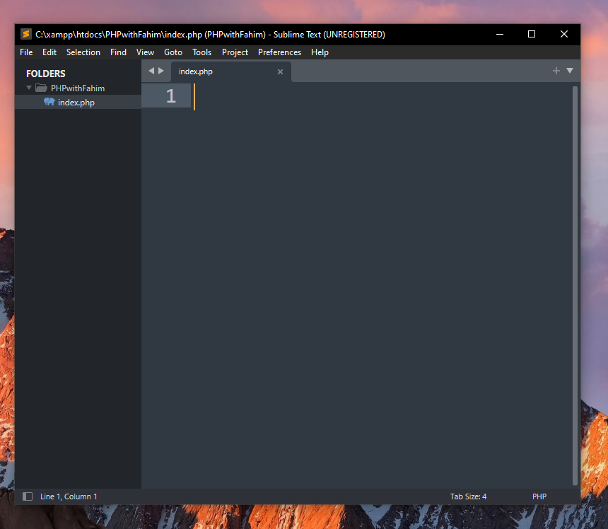
<figcaption align = "center"><b>Create "index.php"</b></figcaption>
</figure>

About the extension, all PHP file has `.php` extensions in them. Therefore, we need to provide the `.php` extension anytime we want to create any PHP file. I will code in VS Code and I will check the output in my browser window.

For the browser, I always prefer the widely popular [Google Chrome](https://www.google.com/chrome/) browser, but you can use other browsers.

<figure>
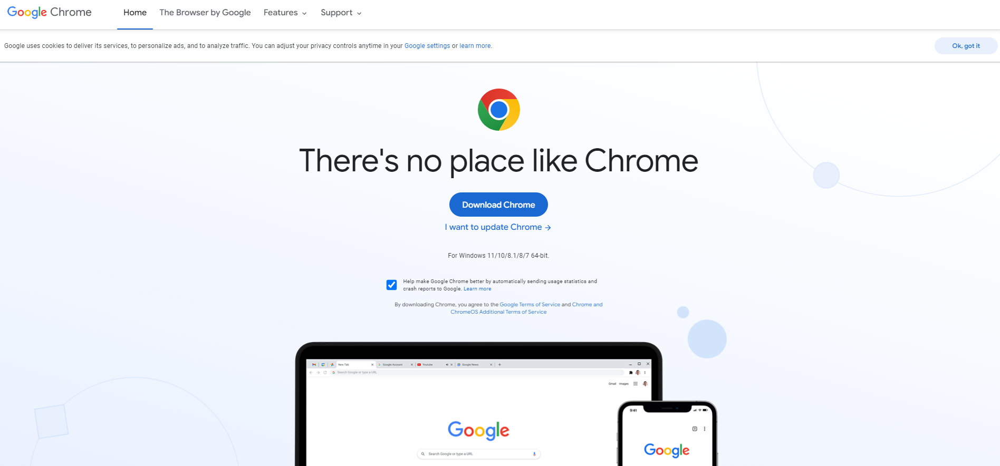
<figcaption align = "center"><b>My preferred browser</b></figcaption>
</figure>

### Change Compatibility (Optional)

I always change the compatibility for two files. I often get many notifications during shutting down XAMPP on Windows. But it is completely an optional task. You do not necessarily need to follow this part if you do not want to tweak these. 

I need to change something more inside the "xampp" folder. Inside the root folder of "xampp", we need to change the compatibility. 

<figure>
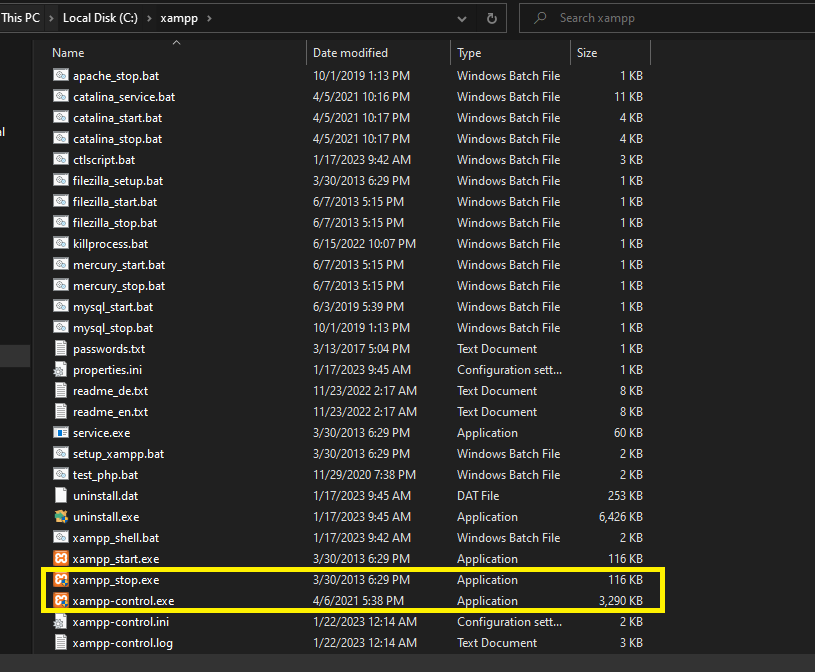
<figcaption align = "center"><b></b></figcaption>
</figure>

Right click on "xampp_stop.exe" and go to properties. 

<figure>
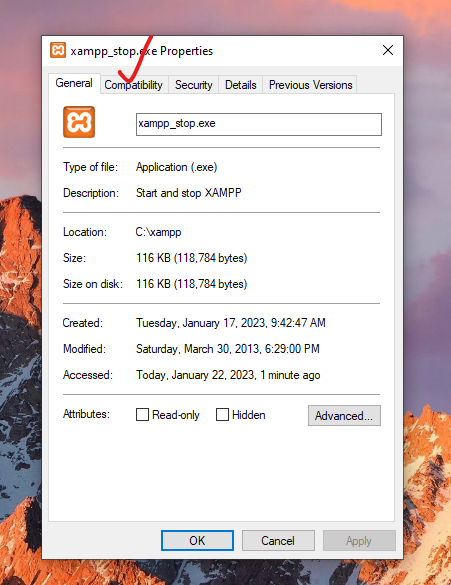
<figcaption align = "center"><b></b></figcaption>
</figure>

Go to the "Compatibility" tab. Make sure to check the box beside "Run this program as an administrator". Then click Apply and OK.

<figure>
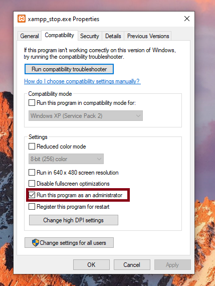
<figcaption align = "center"><b></b></figcaption>
</figure>

You have to do the same thing for "xampp-control.exe" file as well.