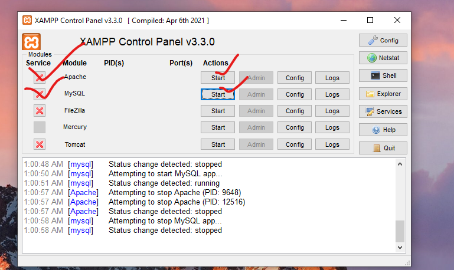
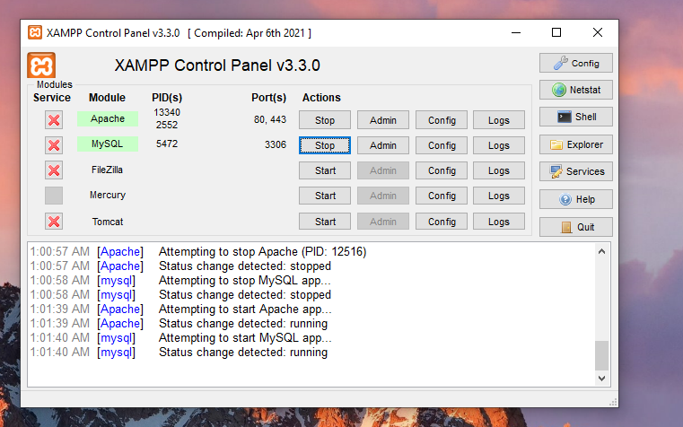
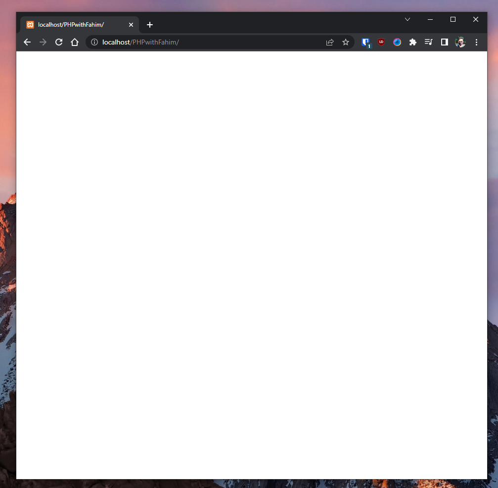
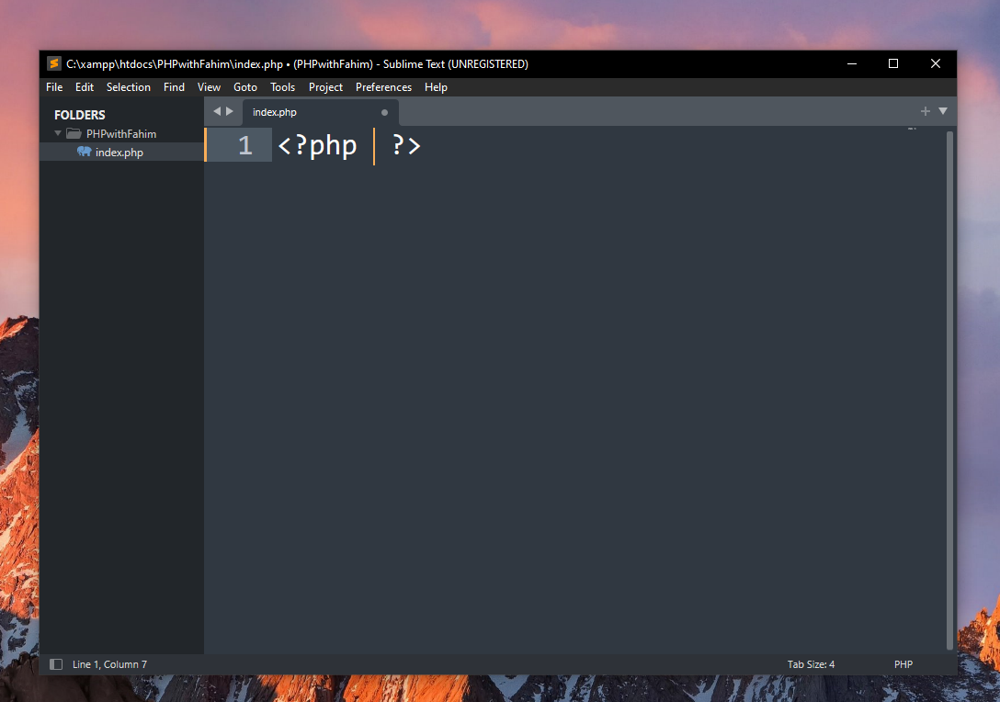
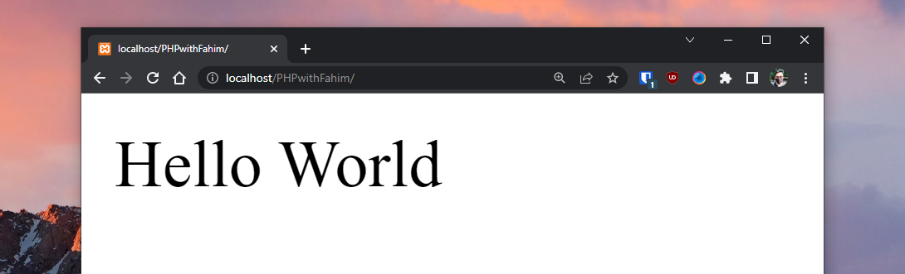

# PHP
A beginners handbook for the PHP learners

👉 [Read the book as a website](https://fahimfba.github.io/php/)
---

I think the first thing that might come into your mind is that "Isn't PHP already dead?" Trust me, I was thinking the same thing when I started learning this language.

## Index
- [PHP](#php)
  - [👉 Read the book as a website](#-read-the-book-as-a-website)
  - [Index](#index)
  - [Introduction (What is PHP?)](#introduction-what-is-php)
  - [Installation](#installation)
    - [Change Compatibility (Optional)](#change-compatibility-optional)
  - [Start `XAMPP`](#start-xampp)
  - [PHP Syntax](#php-syntax)
  - [Hello World in PHP](#hello-world-in-php)
  - [Comments](#comments)
  - [Variables](#variables)
  - [Concatenation](#concatenation)
  - [Data Types](#data-types)
  - [String Data Type](#string-data-type)
  - [Integer Data Type](#integer-data-type)
  - [Float/Double Data Type](#floatdouble-data-type)
  - [Array Data Type](#array-data-type)
  - [Boolean Data Type](#boolean-data-type)
  - [Object Data Type](#object-data-type)


[⬆ Go to up](#php)


## Introduction (What is PHP?)

PHP is actually an abbreviation or acronym for "PHP: Hypertext Preprocessor". It is an open-source scripting language and it is still used widely. Let me tell you about some widely popular websites that use PHP, and it will simply blow your mind thinking that how many popular websites are still using it!

[Facebook](https://facebook.com/), [Wikipedia](https://www.wikipedia.org/), [Tumbler](https://www.tumblr.com/), [Slack](https://slack.com/), [Etsy](https://www.etsy.com/), [MailChimp](https://mailchimp.com/), and even [WordPress](https://wordpress.org/) use PHP! I guess you are also overwhelmed by PHP after getting to know that even these big websites use PHP as a programming language.

[⬆ Go to up](#php)

## Installation

For this book, I am going to use [XAMPP](https://www.apachefriends.org/) and [Sublime Text](https://www.sublimetext.com/) for showing you everything in PHP.  I am not going to take more time here as the installation process is very similar to other normal software. Simply download the latest version of XAMPP for your operating system and install it afterward.  

If you do not change the installation directory of XAMPP during the installation process, then XAMPP will create the installation folder under the `C:` drive. Simply go to your **C** drive and search for a folder named "xampp".

[⬆ Go to up](#php)

<figure>

<figcaption align = "center"><b>The necessary directory of XAMPP in C Drive</b></figcaption>
</figure>

Inside the directory, you will get a bunch of folders and files like below.

<figure>

<figcaption align = "center"><b>A lot of files and folders inside the "xampp" folder, but we do not need to worry about these for now!</b></figcaption>
</figure>

We will go into the "**htdocs**" folder.

<figure>

<figcaption align = "center"><b>"htdocs" folder</b></figcaption>
</figure>

We will see some more folders and files inside the "htdocs" folder.

<figure>

<figcaption align = "center"><b>Folders and Files inside the "htdocs" folder</b></figcaption>
</figure>

We will create a new folder here where we will practice our PHP scripts. For this article, let's say that I am going to use a new folder named "PHPwithFahim". You can name it whatever you want, but make sure not to start the name other than any alphabet, and also do not keep any space between words/characters in the folder name. 


<figure>

<figcaption align = "center"><b>Folder "PHPwithFahim"</b></figcaption>
</figure>

Now open this folder in your Sublime Text. Simply click on "File" and click on "Open Folder...".

<figure>

<figcaption align = "center"><b>Open Folder in Sublime Text</b></figcaption>
</figure>

Select the "PHPwithFahim" folder and open it in Sublime Text.

<figure>

<figcaption align = "center"><b></b></figcaption>
</figure>

Now, create a file "index.php", and save it to "PHPwithFahim" folder. 

<figure>

<figcaption align = "center"><b>Create "index.php"</b></figcaption>
</figure>

About the extension, all PHP file has `.php` extensions in them. Therefore, we need to provide the `.php` extension anytime we want to create any PHP file. I will code in VS Code and I will check the output in my browser window.

For the browser, I always prefer the widely popular [Google Chrome](https://www.google.com/chrome/) browser, but you can use other browsers.

<figure>

<figcaption align = "center"><b>My preferred browser</b></figcaption>
</figure>

[⬆ Go to up](#php)

### Change Compatibility (Optional)

I always change the compatibility for two files. I often get many notifications during shutting down XAMPP on Windows. But it is completely an optional task. You do not necessarily need to follow this part if you do not want to tweak these. 

I need to change something more inside the "xampp" folder. Inside the root folder of "xampp", we need to change the compatibility. 

<figure>

<figcaption align = "center"><b></b></figcaption>
</figure>

Right click on "xampp_stop.exe" and go to properties. 

<figure>

<figcaption align = "center"><b></b></figcaption>
</figure>

Go to the "Compatibility" tab. Make sure to check the box beside "Run this program as an administrator". Then click Apply and OK.

<figure>

<figcaption align = "center"><b></b></figcaption>
</figure>

You have to do the same thing for "xampp-control.exe" file as well.

[⬆ Go to up](#php)

## Start `XAMPP`

Before writing any PHP code, make sure to open XAMPP, and Start the `Apache` and `MySQL` modules. Simply click "Start".

<figure>

<figcaption align = "center"><b></b></figcaption>
</figure>

It will start `Apache` and `MySQL`. Now we are good to go!

<figure>

<figcaption align = "center"><b></b></figcaption>
</figure>

Open the browser and go to `localhost/PHPwithFahim`. It will redirect you to `http://localhost/PHPwithFahim/` automatically every time. Make sure to replace `PHPwithFahim` with the folder name that you are going to use for yourself. 

<figure>

<figcaption align = "center"><b></b></figcaption>
</figure>

Of course, it is currently empty, because we have not written anything to our `index.php` file to display here. 

Now you can start your PHP learning journey!

[⬆ Go to up](#php)

## PHP Syntax

You can place a PHP script anywhere in your document. However, if we talk about the syntax of PHP, then a PHP script always starts with `<?php` and ends with `?>`. You have to use the extension `.php` for any PHP file. PHP is a case sensitive language. We use the semi-colon `;` to state the end of a statement in PHP.
For example:

```php
<?php
// PHP code goes here
?>
```
[⬆ Go to up](#php)

## Hello World in PHP

Sublime text automatically comes with PHP auto-completion features. Simply type `php` and press the `Tab` key. It will automatically provide the boilerplate for your PHP file.

<figure>

<figcaption align = "center"><b></b></figcaption>
</figure>

For printing something, we use `echo`.

For example, as we want to print `Hello World`, we can write `echo "Hello World"` inside the boilerplate`. The code would be like this: 

```php
<?php 
echo "Hello World";	
?>
```

Now, we need to save the file before checking the output. I like to use the shortcut keys, `Ctrl` + `S` to save files.

Now, I can check the output in my browser window. For this, I need to go to `localhost/PHPwithFahim`.

<figure>

<figcaption align = "center"><b></b></figcaption>
</figure>

Please keep in mind, that the font size will not be this much bigger. I zoomed on the browser window before taking the screenshot.

For the rest of the repository, I am not going to use any images as that might create more distraction. But don't worry, as I will obviously state all the inputs and outputs sequentially.

Whenever we want to print something using the `echo`, we need to use single quote or the double quote to specify the whole strings.

Yes, that means, we can also use the single quote instead of the double qoutes if we want. For example, check the below code:

```php
<?php 
echo 'Hello World';	
?>
```

This code also provides the same output as earlier.

```
Hello World
```
But you have to be careful about mixing them, as the mixing of the single and the double quotes will not work!

```php
<?php 
echo "Hello World';	
?>
```
This gives the following error in the browser window as we used the double qoute `"` and th single quote `'` together in a same string.

```
Parse error: syntax error, unexpected end of file, expecting variable or "${" or "{$" in C:\xampp\htdocs\PHPwithFahim\index.php on line 3
```

```php
<?php 
echo 'Hello World";	
?>
```

This also gives error as we again used the single quote and the double quote together in a same string.

```
Parse error: syntax error, unexpected string content "Hello World"; " in C:\xampp\htdocs\PHPwithFahim\index.php on line 2
```

[⬆ Go to up](#php)

## Comments

If you want to include anything in your code that you also do not want to execute, then in those cases, you can use the comments.

For a single line comment you can either start your sentence with a `//` or a `#`.

For example:

```php
<?php

// This is a single line comment using //


# This is also a single line comment but I am using #

?>
```

For a multiple line comment, you have to start the comment with a `/*` and you have to end the comment with a `*/`. We use this multiline comment for documentation most often.

For example:

```php
<?php
/*
This is a multiple line comment block
that spans over multiple
lines and we normally use it to document
our codes.
*/
?>
```

We also use the comment to leave our parts of our code, for test and debugging purposes as well.

[⬆ Go to up](#php)

## Variables

Variables is actually a container for storing data. All variables start with a `$` sign in PHP. We attach the variable name with the `$` symbol.

For example:

```php
<?php
$FirstName = "Fahim";
$LastName = "Amin";
$MyAge = 23;
?>
```

An interesting thing to keep in mind is that PHP actually has no command for declaring any variable. It is created only the moment you first assign a value to it.

However, there are some rules for creating a variables in PHP:

1. Variable must starts with a `$` sign and the name of the variables comes just after that without having any kind of space (` `) between them.
2. Variable name cannot start with a number (1/2/3/4/etc.), and it must starts with a letter or an underscore character (`_`).
3. In a senese, variable name can contain only the alpha numeric characters and underscores (A-Z, a-z, 0-9 and _).
4. Variable names are case sensitive. Therefore, `MyName` and `myName` are certainly two different variables.


If we want to print the variable's value, then we use the `echo` statement which is considered as the print statement in PHP.

For example:

```php
<?php
$FirstName = "Fahim";
$LastName = "Amin";
echo $FirstName;
echo $LastName;
?>
```

Another example where I want to get the summation and the multiplication of two variables:

```php
<?php
$a = 10;
$b = 20;
echo $a + $b; // summation
echo $a * $b; // multiplication
?>
```

[⬆ Go to up](#php)

## Concatenation

We can concate two separate strings with a `.`. 

For example:

```php
<?php 
$FirstName = "Fahim";
$LastName = "Amin";
echo $FirstName . $LastName;
?>
```

The output will be:

```
FahimAmin
```

We can add a space between the two words manually using `.`. 

For example:

```php
<?php 
$FirstName = "Fahim";
$LastName = "Amin";
echo $FirstName . " " . $LastName;
?>
```
The output will be:

```
Fahim Amin
```

But ofcourse, if you want then you can keep a space in any string beforehand.

For example:

```php
<?php 
$FirstName = "Fahim ";
$LastName = "Amin";
echo $FirstName . $LastName;
?>
```

This also generates the same output:

```
Fahim Amin
```

[⬆ Go to up](#php)

## Data Types

PHP has various data types. Those are:

1. String
2. Integer
3. Float/Double
4. Array
5. Boolean
6. Object
7. Resource
8. NULL

[⬆ Go to up](#php)

## String Data Type

A string is a sequence of characters. We can use single quotes or double quotes to create a string. For example:

```php
<?php
$FirstName = "Fahim";
$LastName = 'Amin';
echo $FirstName;
echo $LastName;
?>
```

Output:

```
FahimAmin
```

Here our string is `Fahim` and `Amin`. We can also use the single quote or the double quote to create a string. But we have to be careful about mixing them as that simply will not work.

We can also use the escape character `\` to escape the single quote or the double quote. For example:

```php
<?php
$FirstName = "Fahim's";
$LastName = "Amin's";
echo $FirstName;
echo $LastName;
?>
```

Output:

```
Fahim'sAmin's
```

[⬆ Go to up](#php)

## Integer Data Type

An integer is a whole number. For example:

```php
<?php
$MyAge = 23;
echo $MyAge;
?>
```

Output:

```
23
```

But, there are certain rules for using an integer in PHP:

1. An integer must have at least one digit.
2. It can either be a positive or negative number, but it can not have any decimal point.
3. Integers can be specified in: decimal (base 10), hexadecimal (base 16), octal (base 8), or binary (base 2) notation.

[⬆ Go to up](#php)

## Float/Double Data Type

A float is a number with a decimal point or a number in exponential form. For example:

```php
<?php
$MySalary = 20000.50;
echo $MySalary;
?>
```

Output:

```
20000.5
```

[⬆ Go to up](#php)

## Array Data Type

An array is a data structure that can hold more than one value at a time. For example:

```php
<?php
$MyFriends = array("Fahim", "Israt", "Larisa", "Tashfia", "Nayem");
echo $MyFriends[0];
echo $MyFriends[1];
echo $MyFriends[2];
echo $MyFriends[3];
echo $MyFriends[4];
?>
```

Output:

```
FahimIsratLarisaTashfiaNayem
```

We can also use the `print_r()` function to print the whole array. For example:

```php
<?php
$MyFriends = array("Fahim", "Israt", "Larisa", "Tashfia", "Nayem");
print_r($MyFriends);
?>
```

Output:

```
Array ( [0] => Fahim [1] => Israt [2] => Larisa [3] => Tashfia [4] => Nayem )
```

I will talk about the `print_r()` function later.


[⬆ Go to up](#php)

## Boolean Data Type

A boolean represents two possible states: TRUE or FALSE. For example:

```php
<?php
$IsFahim = true;
$IsAmin = false;
echo $IsFahim;
echo $IsAmin;
?>
```

Output:

```
1
```

You might be wondering why the output is `1` instead of `true`. Well, the reason is that the `echo` statement can only print strings, and the boolean value `true` is actually a string. So, the `echo` statement prints the string `true` which is actually `1`.

You might also be wondering why the output is nothing for the boolean value `false`. Well, the reason is that the `echo` statement can only print strings, and the boolean value `false` is actually an empty string. So, the `echo` statement prints nothing.

[⬆ Go to up](#php)

## Object Data Type

An object is a data type which stores data and information on how to process that data. For example:

```php
<?php 
class Dress {
	public $color;
	public $quantity;

	public function __construct($color, $quantity) {
	   $this -> color = $color;
     $this -> quantity = $quantity;
}
public function message() {
    return "Specification of the dress is -> Color: " . $this -> color . " and Quantity: " . $this -> quantity; 
  }
}

$newDress = new Dress("Pink", 25);
echo $newDress -> message();

?>
```

Output:

```
Specification of the dress is -> Color: Pink and Quantity: 25
```

[⬆ Go to up](#php)